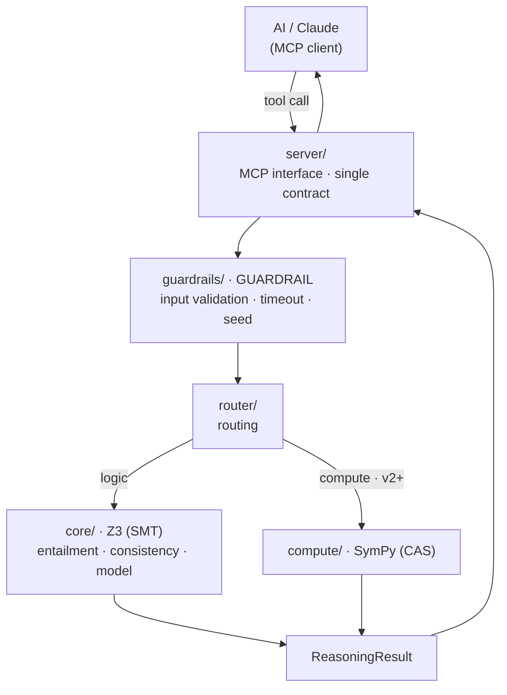
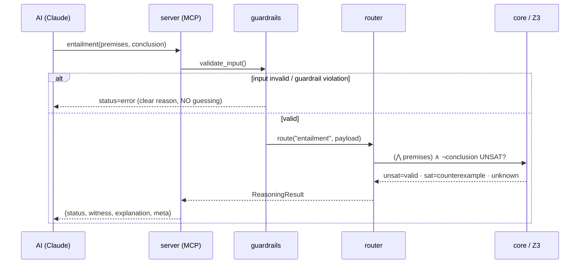

# MathHead — Architecture

Layered hybrid. Each layer has a **single** responsibility; the outside world
touches the engine only through the MCP layer. The rationale for the decisions is
in `../DECISIONS.md`.

## Layer diagram

## Layer responsibilities

| Layer | Does | DOES NOT (its boundary) | File |
|---|---|---|---|
| `server/` | Publishes the MCP tools, converts output to a dict | Holds no business logic | `server/mcp_server.py` |
| `guardrails/` | Validates input, bounds/determinizes the solver | Does not solve math | `guardrails/__init__.py` |
| `router/` | Routes the task to the right solver + primitive (rule-based) | Does not choose "by intuition" | `router/__init__.py` |
| `core/` | entailment / consistency / model via Z3 | Does not do input parsing *on its own* (translate) | `core/logic.py`, `core/translate.py` |
| `compute/` | (v2+) solve/simplify/calculus via SymPy | Empty in v1 (reserved) | `compute/__init__.py` |

## Request lifecycle

## How is determinism guaranteed?

- **Fixed seed** + **single thread**: the Z3 configuration is pinned via
  `solver_config()` → same input, same search path, same output.
- **Timeout**: a worst-case bound; if time runs out, `unknown` (not an error).
- **Traceable `meta`**: every response carries which solver/version/seed/time
  produced it → the result is *reproducible*.

> These three mechanisms are the architectural answer to your **3rd wall**
> (non-determinism): we do not ignore non-determinism, we bound it with a guardrail.
