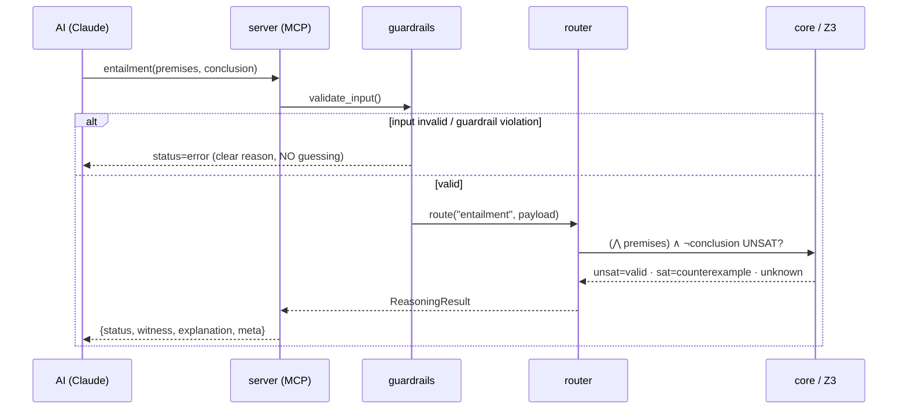

# MathHead — Architecture

Layered hybrid. Each layer has a **single** responsibility; the outside world
touches the engine only through the MCP layer. The rationale for the decisions is
in `../DECISIONS.md`.

## Layer diagram

## Layer responsibilities

| Layer | Does | DOES NOT (its boundary) | File |
|---|---|---|---|
| `server/` | Publishes the MCP tools, converts output to a dict | Holds no business logic | `server/mcp_server.py` |
| `guardrails/` | Validates input, bounds/determinizes the solver | Does not solve math | `guardrails/__init__.py` |
| `router/` | Routes the task to the right solver + primitive (rule-based) | Does not choose "by intuition" | `router/__init__.py` |
| `core/` | entailment / consistency / model / **verification** via Z3 (+ induction, SMT theories, QE, modal) | Does not do input parsing *on its own* (translate) | `core/logic.py`, `core/verify.py`, `core/translate.py` |
| `compute/` | solve / simplify / calculus / linear algebra / number theory / … via SymPy (the full CAS surface) | Does not do logic/proof (that is `core/`) | `compute/__init__.py` |

## Request lifecycle

## How is determinism guaranteed?

- **Fixed seed** + **single thread**: the Z3 configuration is pinned via
  `solver_config()` → same input, same search path, same output.
- **Timeout**: a worst-case bound; if time runs out, `unknown` (not an error).
- **Traceable `meta`**: every response carries which solver/version/seed/time
  produced it → the result is *reproducible*.

> These three mechanisms are the architectural answer to your **3rd wall**
> (non-determinism): we do not ignore non-determinism, we bound it with a guardrail.

> **Honest caveat — reproducibility is *version*-relative.** Fixed seed + single thread
> pin the *search path*, but the exact rendered output can still depend on the backend
> versions (Z3, SymPy) and Python. That is why every `meta` records `z3_version` /
> `sympy_version`, and why the packaged release pins compatible dependency ranges. The
> reproducibility unit is "MathHead 1.0.x **with a known backend set**", not the package
> version alone.

## Public API surface (what is actually the contract)

The **MCP tool layer is the supported, versioned contract** — its tool signatures and the
shared `status` / `reason_code` / `explanation` / `meta` envelope are what external clients
depend on. The Python modules (`mathhead.core.*`, `mathhead.compute.*`, …) are usable and
shown in examples for convenience, but they are **internal surface**: they are NOT covered by
the package's SemVer promise and may be refactored between minor versions. If you need a
stable programmatic boundary, call through the MCP server (or pin an exact package version).
