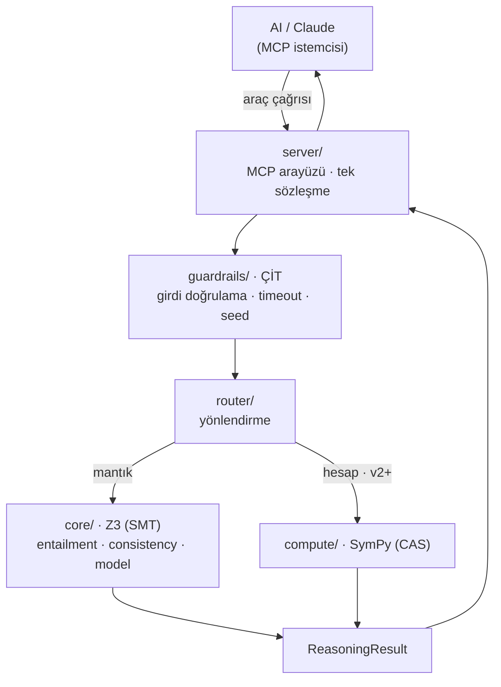
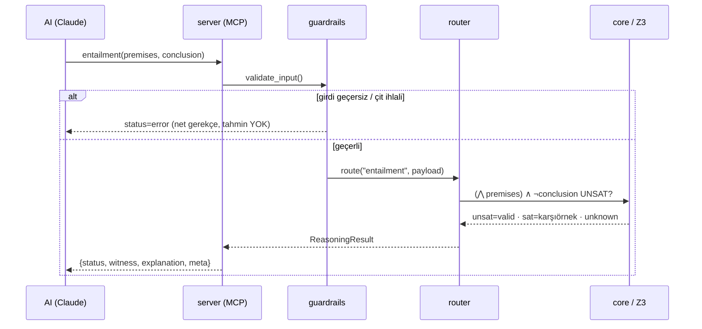

# MathHead — Mimari

Katmanlı hibrit. Her katmanın **tek** sorumluluğu var; dış dünya motora yalnızca
MCP katmanından dokunur. Kararların gerekçesi `../DECISIONS.md`'de.

## Katman şeması

## Katman sorumlulukları

| Katman | Yapar | YAPMAZ (sınırı) | Dosya |
|---|---|---|---|
| `server/` | MCP araçlarını yayınlar, çıktıyı sözlüğe çevirir | İş mantığı içermez | `server/mcp_server.py` |
| `guardrails/` | Girdiyi doğrular, çözücüyü sınırlar/deterministik yapar | Matematik çözmez | `guardrails/__init__.py` |
| `router/` | Görevi doğru çözücü + ilkele yönlendirir (kurallı) | "Sezgiyle" seçmez | `router/__init__.py` |
| `core/` | Z3 ile entailment / consistency / model | Girdi ayrıştırmasını *tek başına* yapmaz (translate) | `core/logic.py`, `core/translate.py` |
| `compute/` | (v2+) SymPy ile solve/simplify/kalkülüs | v1'de boş (rezerve) | `compute/__init__.py` |

## İstek yaşam döngüsü (request lifecycle)

## Determinizm nasıl garanti edilir?

- **Sabit tohum (seed)** + **tek iş parçacığı**: Z3 yapılandırması `solver_config()`
  ile sabitlenir → aynı girdi, aynı arama yolu, aynı çıktı.
- **Zaman aşımı (timeout)**: worst-case sınırı; süre dolarsa `unknown` (hata değil).
- **İzlenebilir `meta`**: her yanıt hangi çözücü/sürüm/seed/süre ile üretildiğini
  taşır → sonuç *yeniden üretilebilir*.

> Bu üç mekanizma, senin **3. duvarına** (non-determinizm) mimari cevaptır:
> non-determinizmi yok saymıyoruz, çitle sınırlıyoruz.
